<div align="center">
  <a href="https://github.com/amanprojects-ops/laravel-modern-news">
    
  </a>

  <h1 align="center">Modern News</h1>

  <p align="center">
    <strong>A Comprehensive Laravel-Based News & Blog Platform</strong>
    <br />
    A robust, full-featured content management system built with the power of Laravel 12 and Tailwind CSS.
    <br />
    <br />
    <a href="#demo">View Demo</a>
    ·
    <a href="#issues">Report Bug</a>
    ·
    <a href="#request-feature">Request Feature</a>
  </p>
</div>

<!-- Badges -->
<div align="center">
  
  
  
  
</div>

<br />

## 📋 Table of Contents

- [About The Project](#-about-the-project)
- [Key Features](#-key-features)
- [Tech Stack](#-tech-stack)
- [Getting Started](#-getting-started)
  - [Prerequisites](#prerequisites)
  - [Installation](#installation)
- [Configuration](#-configuration)
- [Usage](#-usage)
- [Screenshots](#-screenshots)
- [Contributing](#-contributing)
- [License](#-license)
- [Contact](#-contact)

## 📖 About The Project

**Modern News** is a state-of-the-art content management system designed for news agencies, bloggers, and content creators. Built on the latest **Laravel 12** framework, it offers a secure, scalable, and high-performance solution for managing digital publications.

With a mobile-first approach using **Tailwind CSS**, the platform ensures a seamless reading experience across all devices. The powerful admin panel grants granular control over posts, categories, users, and system settings, making it the perfect solution for modern media outlets.

## ✨ Key Features

- **📝 Advanced Post Management**: Create rich content with a WYSIWYG editor, manage drafts, and schedule publications.
- **📂 Dynamic Categorization**: Organize content with a flexible category and tag system.
- **👥 Role-Based Access Control (RBAC)**: Secure admin panel with granular permissions for Admins, Editors, and Authors.
- **🖼️ Media Manager**: Integrated file and attachment management for posts.
- **🔔 Real-time Notifications**: Telegram integration and system notifications.
- **⚙️ Comprehensive Settings**: Customize site identity, social media links, and SEO settings directly from the dashboard.
- **🔍 Intelligent Search**: Fast and accurate content discovery.
- **📱 Responsive Design**: Fully optimized for mobile, tablet, and desktop screens.
- **🚀 High Performance**: Optimized database queries and caching mechanisms (Redis ready).

## 🛠️ Tech Stack

### Backend
- **Framework**: [Laravel 12](https://laravel.com)
- **Language**: PHP 8.2+
- **Database**: MySQL
- **Caching**: Redis / Database

### Frontend
- **Styling**: [Tailwind CSS 4](https://tailwindcss.com) & Bootstrap (Admin)
- **Bundler**: Vite
- **Interactivity**: Vue.js / Vanilla JS

### Services
- **Mail**: SMTP / Log
- **Notifications**: Telegram Channel Integration

## 🚀 Getting Started

Follow these steps to set up the project locally.

### Prerequisites

Ensure you have the following installed:
*   PHP >= 8.2
*   Composer
*   Node.js & npm
*   MySQL

### Installation

1.  **Clone the Repository**
    ```bash
    git clone https://github.com/amanprojects-ops/laravel-modern-news.git
    cd laravel-modern-news
    ```

2.  **Install PHP Dependencies**
    ```bash
    composer install
    ```

3.  **Install Frontend Dependencies**
    ```bash
    npm install
    ```

4.  **Environment Setup**
    Copy the example env file and configure your environment variables:
    ```bash
    cp .env.example .env
    ```

5.  **Generate App Key**
    ```bash
    php artisan key:generate
    ```

6.  **Database Configuration**
    Update your `.env` file with your database credentials:
    ```env
    DB_CONNECTION=mysql
    DB_HOST=127.0.0.1
    DB_PORT=3306
    DB_DATABASE=news_admin  # Change to your database name if different
    DB_USERNAME=root
    DB_PASSWORD=
    ```

7.  **Run Migrations**
    ```bash
    php artisan migrate
    ```
    *Optional: Import the provided SQL file if needed*
    ```bash
    # mysql -u root -p your_database_name < blog.sql
    ```

8.  **Build Assets**
    ```bash
    npm run build
    ```

9.  **Start the Server**
    ```bash
    php artisan serve
    ```
    Visit `http://localhost:8000` in your browser.

## ⚙️ Configuration

### Cron Jobs
This project relies on cron jobs for scheduled tasks. Please refer to the [Cron Job Guide](Cron-Job-Readme.md) for detailed setup instructions.

### Telegram Notifications
To enable Telegram notifications, add your bot credentials to the `.env` file:
```env
TELEGRAM_BOT_TOKEN=your_token
TELEGRAM_CHANNEL_ID=your_channel_id
```

## 💡 Usage

### Content Creation Template
To streamline your workflow, a blog post template is available at. You can use this to draft your content before publishing.

### Admin Panel
Access the admin panel at `/admin/login` (or the configured admin route).

## 📸 Screenshots

<div align="center">
  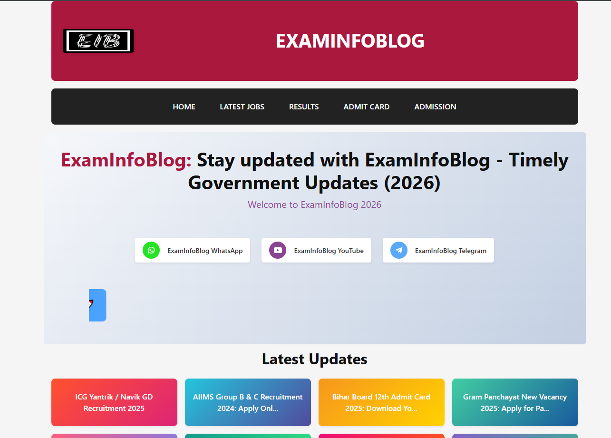
  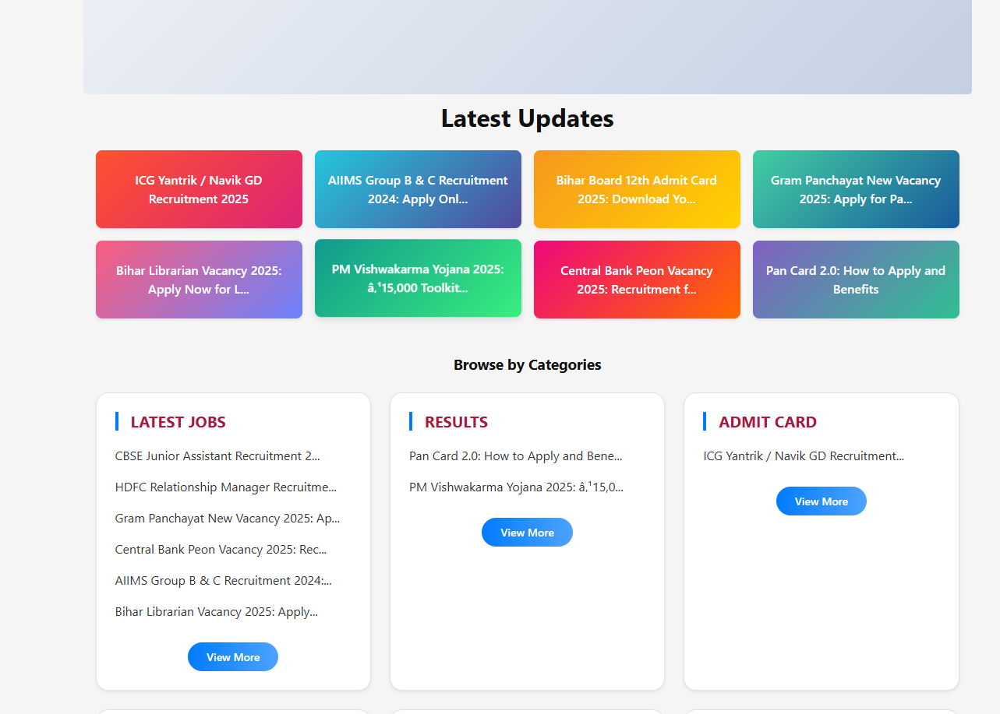
  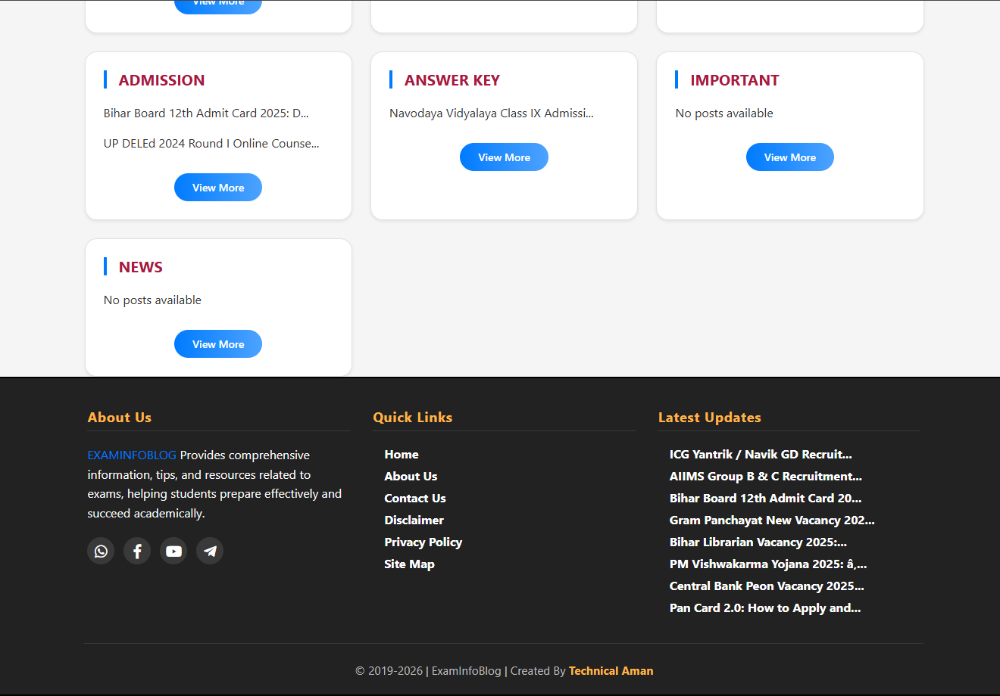
  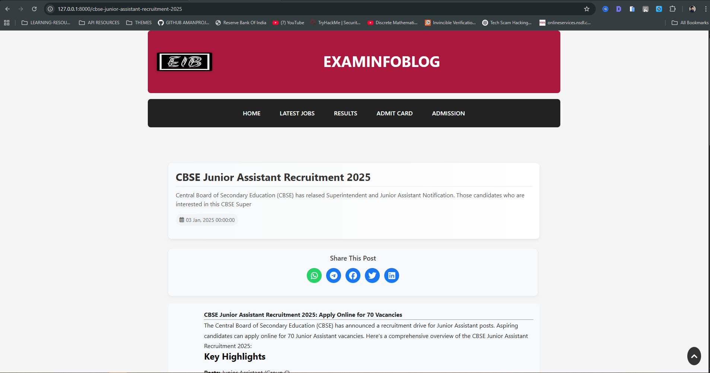
  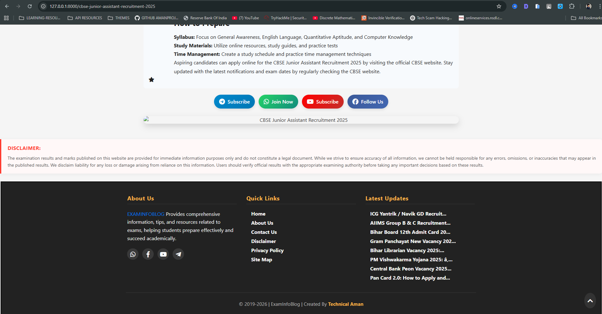
  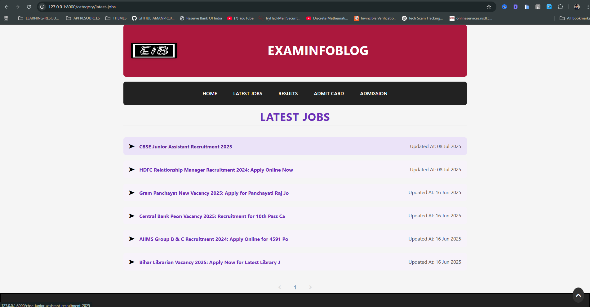
</div>

<details>
<summary><strong>View More Screenshots</strong></summary>
<br>
<div align="center">
  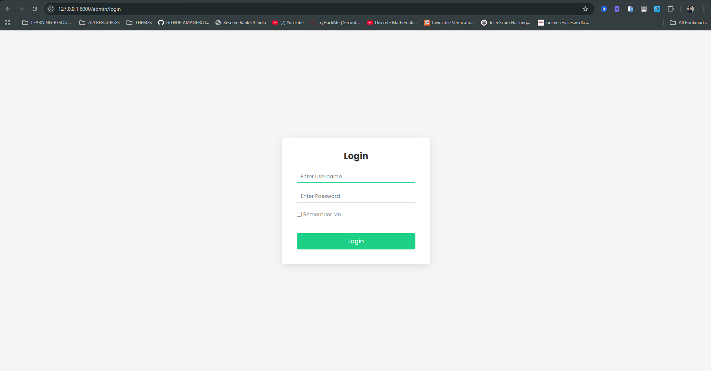
  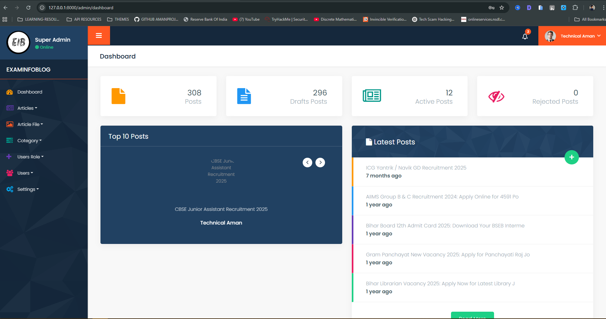
  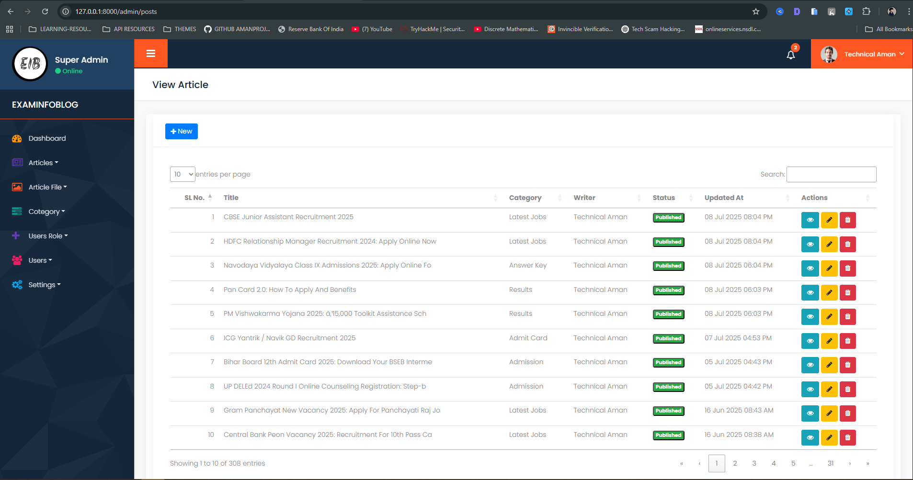
  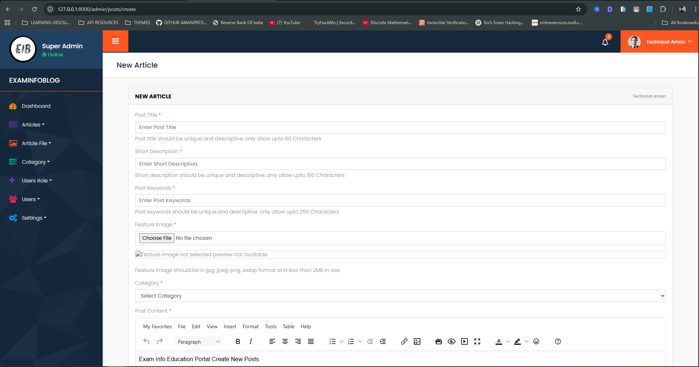
  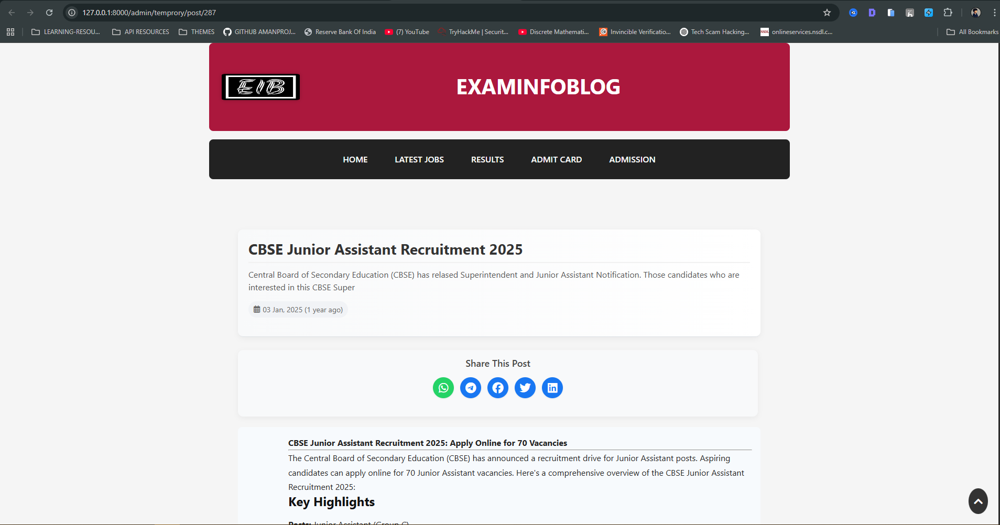
  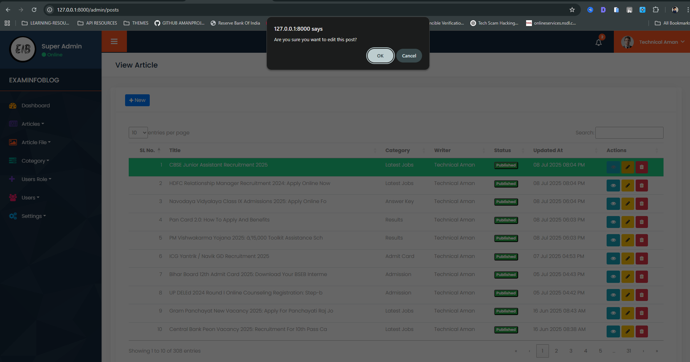
  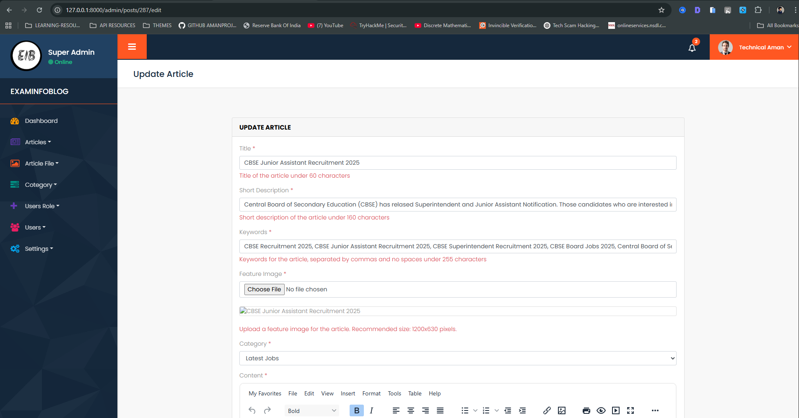
  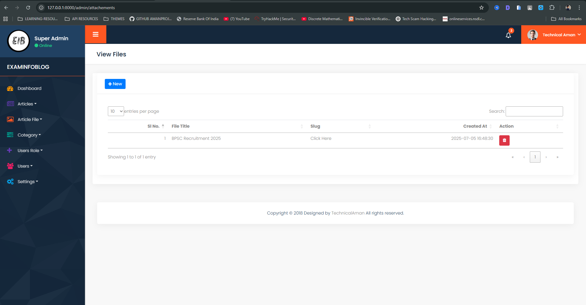
  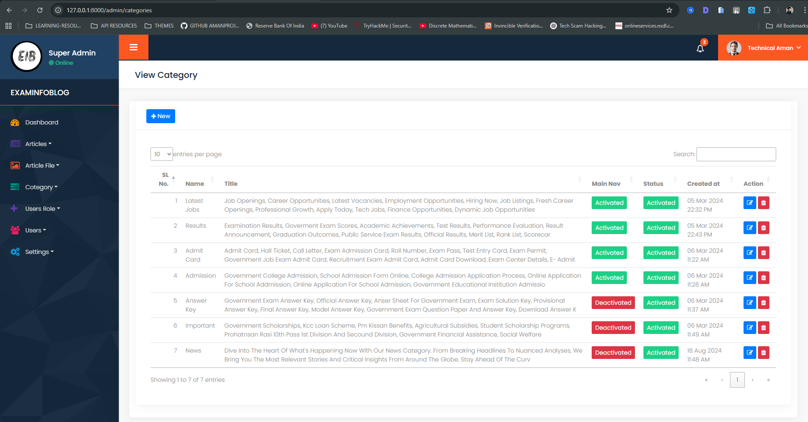
  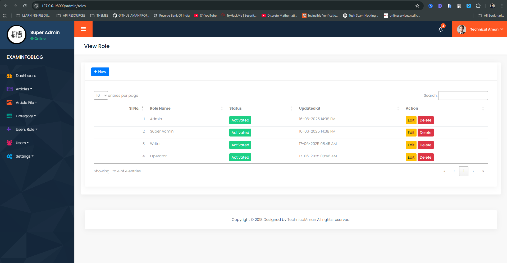
  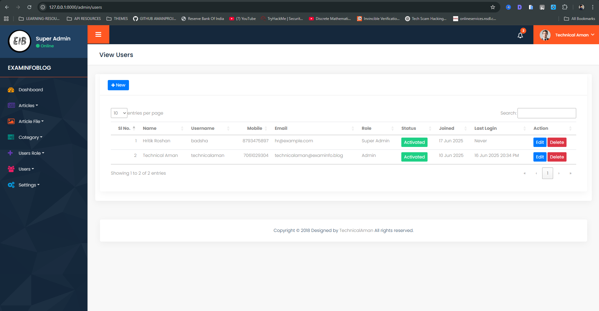
  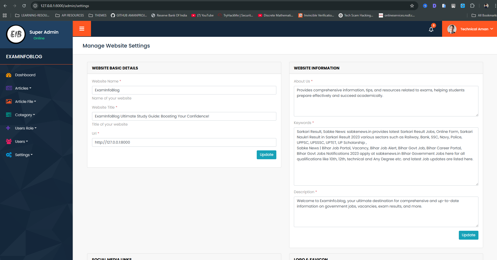
  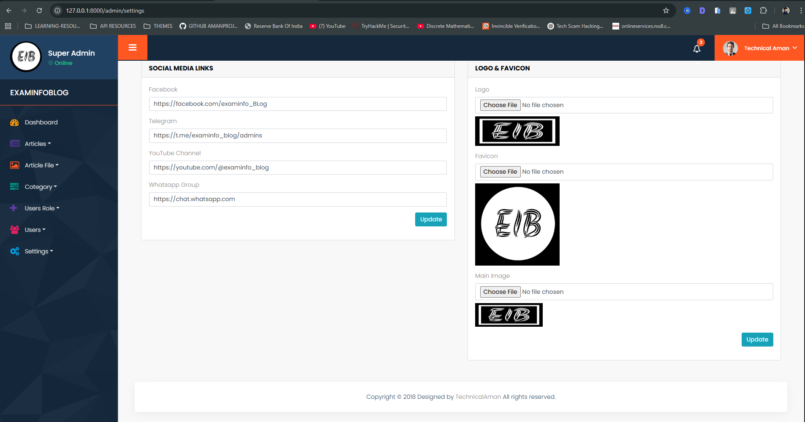
</div>
</details>

## 🤝 Contributing

Contributions are what make the open source community such an amazing place to learn, inspire, and create. Any contributions you make are **greatly appreciated**.

1.  Fork the Project
2.  Create your Feature Branch (`git checkout -b feature/AmazingFeature`)
3.  Commit your Changes (`git commit -m 'Add some AmazingFeature'`)
4.  Push to the Branch (`git push origin feature/AmazingFeature`)
5.  Open a Pull Request

## 📧 Contact

Team Name - [team@amanprojects](mailto:team@amanprojects.com)

Project Link: [https://github.com/amanprojects-ops/laravel-modern-news](https://github.com/amanprojects-ops/laravel-modern-news)

---
<div align="center">
  <sub>Built with ❤️ by Aman Projects</sub>
</div>
